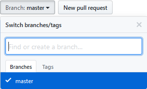
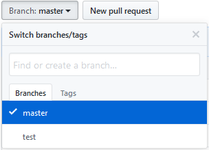

# Git知识点+实际操作（不定期更新）

## 本地分支与远程分支

出于对原作者的尊重，感谢这篇博客：https://www.cnblogs.com/hamsterPP/p/6810831.html

### 添加分支

在git的世界，提起分支，有本地分支和远程分支的区别，其实，如果加上一个“远程仓库中的分支”，更好理解。直接看代码：

```
git checkout -b test
```

这样，就以当前分支（如果没有切换过的话，就应该是master分支）为“复制源”，在本地创建了一个名为test的分支，并切换了过去。观察后续输出：

```
Switched to a new branch 'test'
```

提示我们当前已经切换到test分支。

使用命令查看分支（列出本地分支、远程分支，*所在的分支为当前分支）：

```
$ git branch -a
  master
* test
  remotes/origin/master
```

这时远程github仓库上仍只有master分支：



如果想以本地test分支为基础，推送到远程github仓库，使之成为一个“远程仓库中的分支”，可以用以下命令：

```
git push origin test
```

再查看分支：

```
$ git branch -a
  master
* test
  remotes/origin/master
  remotes/origin/test
```

查看远程github仓库中的分支：



现在，介绍下已经出现的分支：

- test：本地分支；
- remotes/origin/test：远程分支；
- 以及github远程仓库中的分支——test。

（有时，可能由于网络原因，github仓库中不会刷出刚刚添加的分支。不过不用担心，分支其实已被创建。）

三种分支相互独立却又相互联系。其中，本地分支和远程分支存在于本地，远程分支是远程仓库中分支的“索引”，充当桥梁。这时，本地分支和远程分支其实并没有真正建立“灵魂连接”，所以，在test分支下修改代码并试图push时，会报错：

```
$ git push
fatal: The current branch test has no upstream branch.
To push the current branch and set the remote as upstream, use

    git push --set-upstream origin test
```

意思是说，当前test分支没有与之对应的上游分支，如果要push当前分支，并把remote设为上游，请使用：

```
git push --set-upstream origin test
```

乖乖听话，按它说的做……一堆提示的最后：

```
Branch 'test' set up to track remote branch 'test' from 'origin'
```

这就成功了。

如果只是想链接一下而不push，这样操作就好：

```
git branch -u origin/test test
```

其实，在使用git checkout -b test创建本地分支之后，直接执行：

```
git push --set-upstream origin test
```

更为方便，直接建立链接。

### 删除分支

三种分支可以任意删除。不过不能在当前分支下删除当前分支。

删除本地分支：

```
git branch -d test
```

删除远程分支：

```
git branch -r -d origin/test
```

删除远程仓库中的分支比较特殊，需要push命令：

```
git push origin :test
```

同样地，如果直接删除远程仓库中的分支，那么远程分支也会被删除。

### 拉取分支

经过上面的操作，即使已经在github仓库中创建了test分支，但在已经存在这个仓库的另一台电脑B上查看所有分支时，仍看不到test分支，需要拉取一下：

```
git fetch
git branch -a

//拉取到了远程分支
* master
  remotes/origin/HEAD -> origin/master
  remotes/origin/test
  remotes/origin/master
```

然后新建分支并关联：

```
git checkout -b 本地分支名 origin/远程分支名
```

在这里，需要执行：

```
git checkout -b test origin/test
```

即可。

-----------------

或者，在拉取到远程分支之后，分开来操作：

```
//新建本地分支
git checkout -b test
//与远程分支建立链接
git branch --set-upstream-to=origin/test test
//拉取分支的更新
git pull
```

