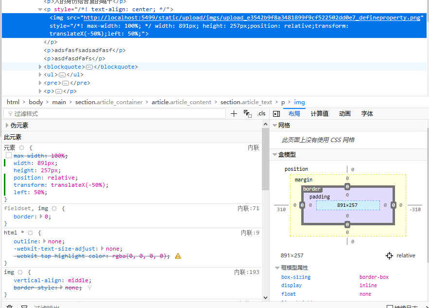
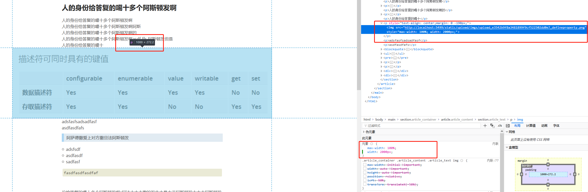

1、其实就是：

（只靠子元素自己就可以居中）

position: relative;

left: 50%;

transform: translateX(-50%);

2、父元素

（需要父子搭配）

display: flex;

justify-content: center;（控制居左、中、右）

子元素

flex: none;

可以实现图片宽度超过父元素时，左对齐右对齐的效果。

3、

但是，超出父元素宽度的图片，实现不了左对齐、右对齐的效果。

