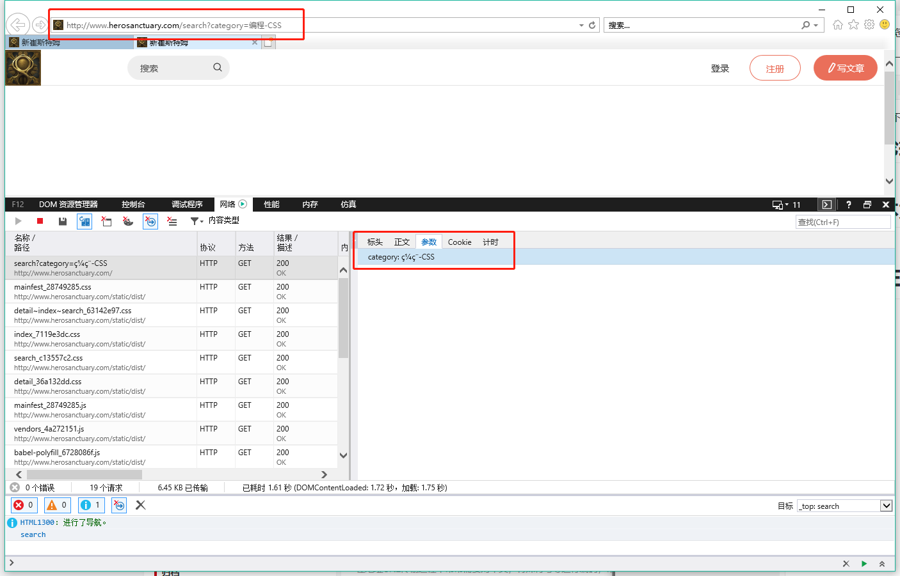

# 网站如何兼容IE9？（持续更新）

## 1、IE9不支持transform

IE9不支持css3 transform，导致用el.style.transform获取到的是undefined，假如有这么一行代码：

```
let originAngle = el.style.transform.replace(/\D/ig, '');
```

浏览器会直接报错，因为el.style.transform是undefined。

用一个简单的判断即可解决报错的问题：

```
let originAngle = el.style.transform ? el.style.transform.replace(/\D/ig, '') : 0;
```

但不能奢望有动画效果了……

## 2、轮播图运动类

如上所说，在IE9中不能使用transform做动画，所以轮播图的实现只好依赖绝对定位的位置改变。

还好学过运动框架的实现，做起来也很简单：

```
if (!window.requestAnimationFrame) {
  window.requestAnimationFrame = (function () {
    return window.requestAnimationFrame ||
      window.webkitRequestAnimationFrame ||
      window.mozRequestAnimationFrame ||
      function (callback) {
        return window.setTimeout(callback, 17);
      };
  })();
}
if (!window.cancelAnimationFrame) {
  window.cancelAnimationFrame = function (id) {
    clearTimeout(id);
  };
}
/**
 * 运动类
 * @param {HTMLElement} el 要运动的DOM元素
 */
class Move {
  constructor(el) {
    this.el = el;
    this.timer = undefined;
  }
  getStyle(obj, style) {
    if (window.getComputedStyle) {
      return getComputedStyle(obj)[style];
    }
    return obj.currentStyle[style];
  }
  changeStyle(obj, key, p) {
    if (key == 'opacity') {
      obj.style.opacity = p / 100;
      obj.style.filter = 'alpha(opacity=' + p + ')';
    } else {
      obj.style[key] = p + 'px';
    }
  }
  _linearMove() {
    let d = this.times;                    //总持续时长d
    let t = +new Date() - this.startTime;  //已经过时间t
    for (const key in this.json) {
      if (this.json.hasOwnProperty(key)) {
        let b = this.iCur[key];            //开始位置b
        let c = this.json[key] - this.iCur[key];//要运动的总距离c
        let p = t * (c / d) + b;
        this.changeStyle(this.el, key, p);
      }
    }
    if (t <= d) {
      this.timer = requestAnimationFrame(this._linearMove.bind(this));
    } else {
      cancelAnimationFrame(this.timer);
      for (const key in this.json) {
        if (this.json.hasOwnProperty(key)) {
          this.changeStyle(this.el, key, this.json[key]);
        }
      }
    }
  }
  /**
   * 结束运动
   */
  cancelMove() {
    cancelAnimationFrame(this.timer);
  }
  /**
   * 动起来！
   * @param {string} style 运动类型，暂时只有linear线性可选
   * @param {object} json 运动目标，如{width: 200}
   * @param {number} times 运动持续时间
   */
  move(style, json, times) {
    this.json = json;
    this.startTime = +new Date();
    this.iCur = {};
    this.times = times;
    for (const key in json) {
      if (json.hasOwnProperty(key)) {
        if (key === 'opacity') {
          this.iCur[key] = Math.round(this.getStyle(this.el, key) * 100);
        } else {
          this.iCur[key] = parseInt(this.getStyle(this.el, key));
        }
      }
    }
    switch (style) {
      case 'linear':
        this.timer = requestAnimationFrame(this._linearMove.bind(this));
        break;
      default:
        break;
    }
  }
}

export { Move };
```

如果这个运动类只给IE9浏览器用的话，上述代码有几处其实没必要做兼容性：

- requestAnimationFrame和cancelAnimationFrame，因为IE9及以下版本浏览器不支持这对方法……直接setTimeout即可。
- css-opacity，IE9已经支持了，要兼容IE8及以下版本才需要filter；
- getComputedStyle，一个很“刺激”的知识点，以后会单篇记录。IE9已经支持了，IE8及以下使用el.currentStyle；

最后是ES6本身，class语法的兼容性，需要在babel中配置。

## 3、不支持flex

这个最扎心了。乖乖用经典布局吧= =。

本来在项目开始前，我的博客网站没想着要兼容低级浏览器。只不过做完之后，看着它在IE9上的表现，实在是不舒服，还是解决了吧。

我的解决方式是，针对IE9浏览器，动态引入经典布局CSS代码，其余浏览器，仍使用flex。

## 4、IE全系浏览器不能直接识别汉字URL查询参数



这个时候，就需要针对IE浏览器，利用`encodeURIComponent()`，进行URL查询参数的编码了。借机了解一下它与`encodeURI()`的异同：

两种方法**都不会**编码 ASCII 字母、数字、某些 ASCII 标点符号：- _ . ! ~ * ' ( )

`encodeURIComponent`会编码;/?:@&=+$,#

`encodeURI`不会编码;/?:@&=+$,#

下面是直观的例子：

```
encodeURIComponent('http://www.herosanctuary.com/search?keyword=哈哈')
//"http%3A%2F%2Fwww.herosanctuary.com%2Fsearch%3Fkeyword%3D%E5%93%88%E5%93%88"

encodeURI('http://www.herosanctuary.com/search?keyword=哈哈')
//"http://www.herosanctuary.com/search?keyword=%E5%93%88%E5%93%88"
```


## 5、IE全系浏览器自动缓存ajaxGet请求

当我使用携带cookie的ajax get请求与服务器进行持久化登录验证，或者登出的时候，除了第一次请求，IE浏览器总会命中缓存，即使我在服务端对这个请求设置了Cache-control: no-cache或no-store，或者max-age: 0。最后还是通过在get请求中添加无实际意义的、随机查询参数解决的。

```
const authentication = () => {
  return axios.get(`${requestURL}user/authentication${ISIE ? `?token=${Date.now()}` : ''}`);
};
```

## 6、配置babel

如果不好好配置一番babel的话，这个博客在IE11上都跑不起来，Google和firefox倒是没问题。

首先，因为Babel 默认只转换新的 JavaScript 语法，如箭头函数、解构赋值、class，而不转换新的 API。所以需要在webpack配置文件的entry顶部全局引入babel-polyfill，提供对新API的垫片，如Iterator、Generator、Set、Maps、Proxy、Reflect、Symbol、Promise 等全局对象，以及一些定义在全局对象上的方法（比如 Object.assign）：

```
entry: {
    'babel-polyfill': 'babel-polyfill',
    index: './src/index.js',
  },
```

其次，在babel配置文件中：

```
{
  "presets": [
    ["env", {
        "targets": {
          "browsers": ["last 2 versions", "ie >= 9"]
        }
      }],
    "react",
    "stage-0"//提供对最新尚未写入规范中语法的支持，如动态引入import()。
  ],
  "plugins": [
    ["import",{//配置antd按需加载
        "libraryName": "antd",
        "libraryDirectory": "es",
        "style": "css"
      }],
    ["transform-runtime"]//提供编译模块复用的工具函数。
  ]
}
```

## 7、配置autoprefixer

如果在IE10下使用flex，那么久必须添加浏览器私有前缀，可以使用postcss的autoprefixer插件自动完成：

```
//新建postcss.config.js
module.exports = {
  plugins: [
    require('autoprefixer')({ browsers: ['ie>8'] })
  ],
};
```

不过必须先在webpack配置文件中指定loader：

```
module: {
  rules: [
    {
      test: /\.scss$/,
      use: ExtractTextPlugin.extract({
        use: [
          'css-loader',
          'postcss-loader',
          'sass-loader',
        ],
        fallback: ['style-loader'],
      }),
    },
  ],
},
```

## 8、ie9不支持el.classList

在网上找到了垫片：

```
if (!("classList" in document.documentElement)) {
  Object.defineProperty(HTMLElement.prototype, 'classList', {
    get: function () {
      var self = this;
      function update(fn) {
        return function (value) {
          var classes = self.className.split(/\s+/g),
            index = classes.indexOf(value);

          fn(classes, index, value);
          self.className = classes.join(" ");
        }
      }
      return {
        add: update(function (classes, index, value) {
          if (!~index) classes.push(value);
        }),
        remove: update(function (classes, index) {
          if (~index) classes.splice(index, 1);
        }),
        toggle: update(function (classes, index, value) {
          if (~index)
            classes.splice(index, 1);
          else
            classes.push(value);
        }),
        contains: function (value) {
          return !!~self.className.split(/\s+/g).indexOf(value);
        },
        item: function (i) {
          return self.className.split(/\s+/g)[i] || null;
        }
      };
    }
  });
}
```

