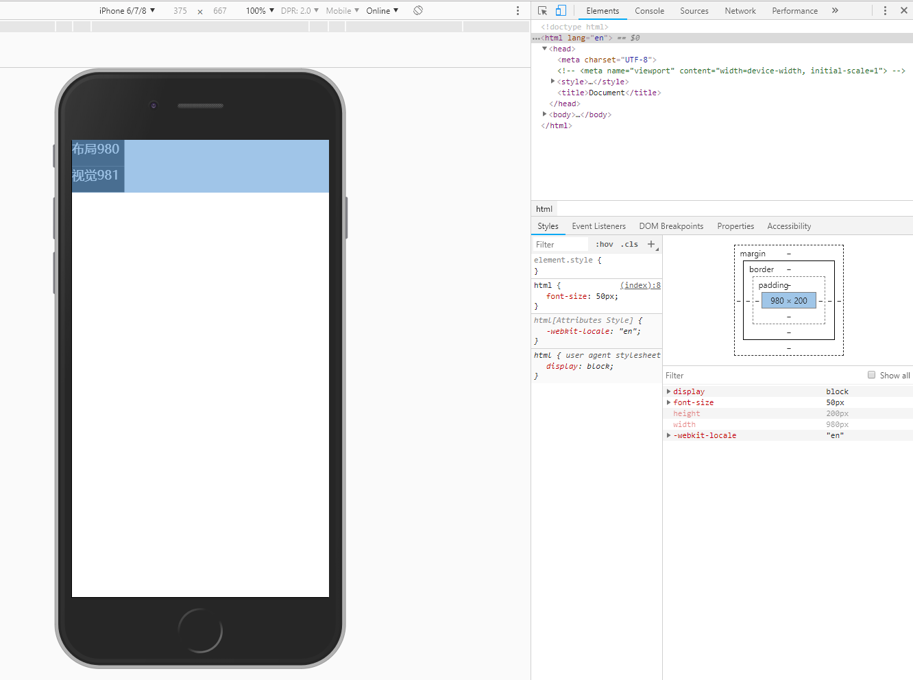
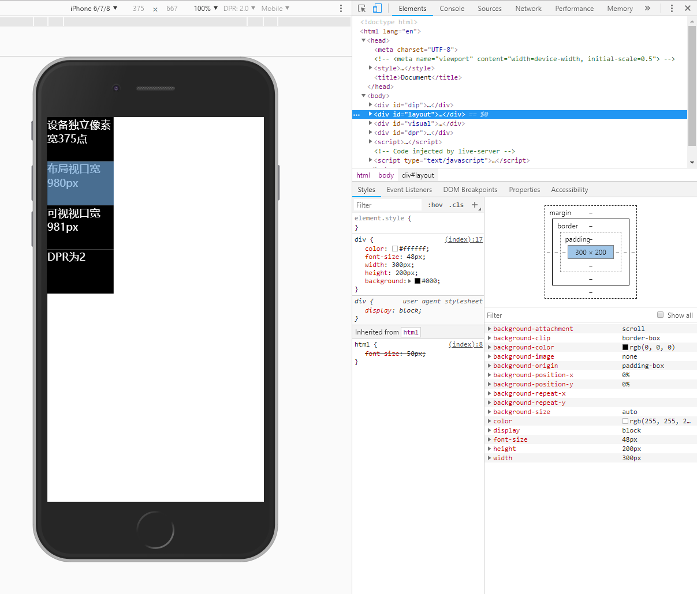
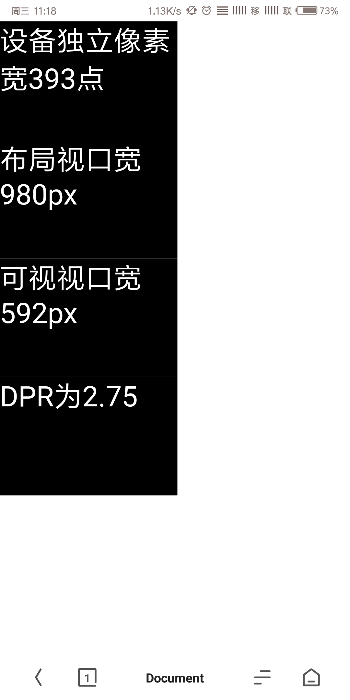
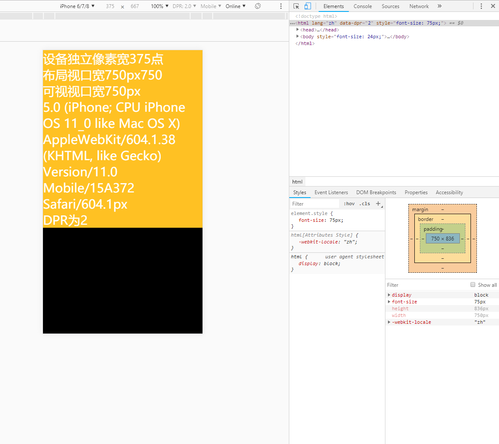

# 移动端适配

## 写在“适配”之前

在学习适配的时候，总是有人向我们展示类似这样的情形：



这里，有几个数值需要阐述一下：

**注意，此时`meta viewport`标签是被注释了的，不生效。**

- 模拟出来的IPhone6/7/8，分辨率是750像素*1334像素，实际设备的分辨率也是如此；
- 设备名称旁边，有375*667，DPR是2.0；
- 屏幕里，布局980，视觉981，右边样式编辑器里，当前`<html>`元素尺寸为980px*200px。

其中，设备分辨率为750像素*1334像素，也被称为物理分辨率，指的是该设备在横向上有750个像素点，在竖向上有1334个像素点。如果您想问一个像素点有多大，那么您可能已经掉进坑里了——像素的大小是不确定的！就拿一台1920像素\*1080像素分辨率的设备来说，横向上，1920个像素点，可以被放进电脑显示器里，成为一台全高清显示器；同样可以被塞进一台巴掌大小的iPhone8P里面，彼此的像素点大小是完全不一样的，但是它们都有1920\*1080个像素点！

接下来说说375\*667，在这里，我耍了个小心机——您会发现，我没有给它们单位。您可能在其他地方看到过这样的说法：“手机分辨率是750px\*1334px、设备尺寸/逻辑分辨率/设备独立像素/CSS像素 是375\*667、设备独立像素就是CSS像素、一个div的宽度是200px。”——十分地让人头痛，同样是像素，差别怎么就这么大？

先忽略这些像素，忽略移动端上的网页开发吧。

### “点”

在4代IPhone以前，没有这么多概念，屏幕上只有320\*480个像素点，按像素计算屏幕尺寸的话，也是320\*480像素。开发IOS APP的时候，直接按照这个尺寸设计开发就行了，不会出现适配的问题；

到了iPhone4，在物理尺寸不变的情况下，像素点个数成倍增加，达到了640\*960个像素点。这样就出现了一个问题，怎样让原有的App运行在新的手机上面？为了运行之前的App，苹果公司引入了一个新的概念——point（点）。

“点”是一种抽象的单位，只有在数学概念里的坐标空间内才有效。“点”需要被渲染到以实际的物理像素点为单位，才能被显示到屏幕上，渲染的过程中，需要乘以一个倍数。

iPhone4屏幕尺寸继续保持320\*480，不过单位并非是像素，而是点。 当我们以“点”为单位描述IPhone手机的分辨率时，其实是说的它的**“逻辑分辨率”**。

“点”的概念出现以后，苹果公司可能会给开发者一份公告：“所有的IOS APP开发，请以‘点’为单位，以前你们按照多少像素数为尺寸开发，现在就以多少点数为尺寸，适配工作由IOS系统来承担”。

刚才说，“渲染的过程中，需要乘以一个倍数”。四代iPhone以前，一个“点”跟屏幕上的一个物理像素点完美对应，是1:1的关系，渲染时，乘以1就可以了。从iPhone4开始，“点”和物理像素点出现了倍数关系，还是拿IPhone6/7/8来说，375\*667个点，要被渲染到750\*1334个像素点上，宽和高各乘以2就可以了。这么一来，在面积上，一个“点”占用了四个像素点。

**这个倍数，在移动端WEB开发中，其实就是设备像素比——DPR。**

### 设备独立像素

设备独立像素的概念，我这里采用的是维基百科提供的信息：

> A **device-independent pixel** (also: *density-independent pixel*, *dip*, *dp*) is a physical unit of measurement based on a coordinate system held by a computer and represents an abstraction of a pixel for use by an application that an underlying system then converts to physical pixels. 
>
> ...
>
> on the Android operating system a device-independent pixel is equivalent to one physical pixel on a 160 dpi screen.
>
> 设备独立像素是一种物理测量单位，它建立在由计算机提供的坐标系统之上，代表像素的抽象概念，由应用程序使用，再被底层系统转为物理像素。
>
> ...
>
> 在安卓操作系统上，在160 DPI屏幕上，一个设备独立像素等于一个物理像素。

细细研读这个概念，可以发现，“设备独立像素”其实和“点”表示相同的抽象意义。

其实还有其他的佐证。继续看。

### DPI和PPI

DPI（Dots Per Inch），在[安卓开发指南](https://developer.android.com/guide/practices/screens_support#overview)中，明确指出它是屏幕物理区域中的像素量，每英寸像素点数。

PPI（Pixel Per Inch），顾名思义，每英寸……像素点数……

明明是一个东西啊！也就是说——在安卓操作系统上，在160 PPI屏幕上，一个设备独立像素等于一个物理像素。

那么……在苹果设备上：

- 在iPhone4以前，屏幕PPI为163，一个“点”等于一个物理像素，
- 在iPhone4/5/6/7/8上，DPR为2，一个“点”占用两个物理像素，如果强制让一个点等于一个物理像素，就得让屏幕的326PPI/2=163PPI；
- 在iPhoneX上，DPR为3，一个“点”占用三个物理像素，如果强制让一个点等于一个物理像素，就得让屏幕的458PPI/3=152.67PPI；

已经非常接近了。有误差，可能是因为像素点距有差别，iPhone X误差比较大，可能是因为刘海拉低了PPI……


设备独立像素，也许是谷歌最先提出来的，也许不是，但这并不妨碍我们理解。我认为：

**如果没有单位，设备独立像素数=点数=逻辑分辨率数=屏幕尺寸数。当然，如果以“点”为单位，它们也是相等的。如果以物理像素点为单位，它们都要乘以那个倍数，也就是设备像素比。**

在JS中，可以通过`window.devicePixelRatio`获取设备像素比，可以通过`screen.width/screen.height`获取设备独立像素。

### CSS像素与两种视口

`<html>`元素尺寸为980px*200px。

这才是我们的亲人！CSS像素，px，亲切的气息铺面而来！

先放下激动，我们仔细想一想，有了前面的知识铺垫，我们会自然而然地想——一个CSS像素，即1px，占用屏幕上多少个物理像素点？又相当于多少个设备独立像素？

答案是：不确定。先回到一开始的例子，是时候讲讲980px的由来了。

### 可视视口与布局视口

很久以前，网页都是为桌面浏览器准备的，也只有一个视口（viewport），视口的宽度就是浏览器窗口的宽度，`<html>`的初始宽度就是视口的宽度，所以CSS百分比布局在桌面浏览器的100%缩放层级下，显示起来很OK。

但是手机出现了，最开始没有啥DPR2.0、DPR3.0，跟老iPhone一样，统统都是1.0，出现的问题就是：如果手机浏览器的视口，也等于浏览器窗口的宽度（太窄了），那么所有的百分比布局都不会达到预期的效果！所以浏览器厂商为了提供良好体验，琢磨出了两个视口——可视视口（visual viewport）与布局视口（layout viewport）。

布局视口为整个页面服务，包含了所有的页面元素，它和当时电脑上的页面通用大小差不多大：

- Safari iPhone 是 980px；
- Android WebKit 是 800px；
- Opera 是 850px；
- IE 是 974px。 
- （但是现在好像安卓爱疯都是980px了……）

布局视口可以用`document.documentElement.clientWidth`得到尺寸。

可视视口为缩放页面服务，它的大小，是手机浏览器上可以看到的那部分网页的大小，更确切地说，是浏览器窗口容纳了多少个CSS像素。

可视视口用`window.innerWidth`得到尺寸。

两种视口尺寸都是以CSS像素计（px）。

绝大多数浏览器，在打开一个网页时，都会把页面缩放到最小，这时，980px宽的网页，全部展现在手机小屏上，这意味着——布局视口和可视视口都是980px宽，看起来像这样：

（我真的不知道这个模拟出来为啥是981px……安卓手机上实测都是980px……）



您可能觉得这样的效果还可以，起码能看清……但这是48px的字体，桌面网站字体都比较小。

来看一看发生了什么：980**px**宽的视口（页面），在375**点**宽的逻辑分辨率上展示，最终被渲染在750**像素点**宽的手机屏幕上。

当我们缩放页面：

（用实机测试——小米Mix2s）



这是放大页面的情况，可以看到，可视视口的宽度减少了，布局视口的宽度不变。

这是因为，缩放页面是通过拉伸CSS像素实现的，实际上是在缩放可视视口的大小，也就是在缩放CSS像素的大小——缩放之前，可视视口内有980px占据着1080个物理像素点（这是Mix2s的物理分辨率）；缩放之后，可视视口内有592px占据着1080个物理像素点。显然地，每个CSS像素都被放大了。

所以，1个CSS像素所占用的物理像素点个数不确定的原因就是——CSS像素也是个虚拟的、抽象的、不能用绝对长度度量的单位，只为前端开发服务，它随时可能被缩放，连自身的大小都不确定。

到这里，铺垫部分结束了。其实我只表达了一个想法：绝大多数情况下，并不用关心设备的实际物理分辨率，比如1920\*1080，2160\*1080等等，我们只需要关注逻辑分辨率就可以了，也就是PPK所述的**设备像素**。

## `<meta name="viewport">`

谢谢这条meta，它为我们完成了一半的适配工作。

苹果发明这条meta的原因是，纵使用户可以缩放页面，阅读文字也是很困难的：

- 如果`<html>`元素没有设置宽度，那么它就会占用100%布局视口的宽度，大段文字总是贯穿整个布局视口，导致放大页面之后，即使能看清文字，可视视口容量有限，阅读文字时也要不停左滑右滑屏幕；
- 即使给`<html>`设置了宽度，比如设置`html: {width: 320px}`，那么手机在初始呈现页面时，会显示整个980px宽的布局视口——网页绝大部分都是空白的！在桌面浏览器上，也会带来更糟糕的效果。

所以，就有了这样的meta：

`  <meta name="viewport" content="width=device-width, initial-scale=1"> `

它的作用有两个：

1. `width=device-width`：重设布局视口的宽度。而`device-width`是个特殊值，指的是设备的逻辑分辨率（理想视口）宽。即，把布局视口的宽，设置为逻辑分辨率的宽，这样，一个px就严格等于一个“点”了。
2. `initial-scale=1`：按照设备的理想视口的宽度，成反比缩放后，设置可见视口的宽度。笼统来讲，`1`是个特殊值，它也会把布局视口的宽度设为理想视口的宽度。分开来说，在苹果机上（我用的chrome模拟器……），布局视口宽度也会缩放；在安卓机上（实机），只要不是`1`，布局视口就是980px。

拿iPhone6/7/8来说，现在，我们的布局视口在宽度上能完美容纳375px，不会出现横向滚动条。

## 适配历程

**下面的适配，统一理想视口下进行。**

接下来就可以正式进入适配阶段了。所谓适配，就是让同一个样式，在移动端各种设备下都能达到尽可能相同的表现，适配的发展历程可谓是一波三折：

1. 响应式：主要通过媒体查询，为不同尺寸范围内的设备提供不同的界面。随着设备越来越多，工作量也越来越大，代码也更加累赘；

2. 百分比加固定高度：流式布局的一种。但因为高度固定，很可能会出现一个容器非常宽，但高度很小的情况；

3. 自适应rem布局：

   新单位rem（`<html>`元素字体的大小）实际为CSS提供了统一度量布局视口的单位，通过把不同大小的布局视口统一分割成X份，每份就是1rem，使元素在不同设备下尽可能有一致的表现。

   如果想让一个元素占用页面百分之百的宽度，用百分比布局也不错，但我们现在用rem实现。

   让我们先把屏幕分成10份。拿iPhone6/7/8来说，布局视口宽375px，元素得有375px的宽度才能占满屏幕。如果使1rem=37.5px，整个屏幕就被划分成了10rem宽。可以给元素设置`{width: 10rem}`达到预期的效果。

   如果设备换了呢？比如现在我手机变成393点宽了——通过JS动态计算就可以了。

   ```JavaScript
   window.addEventListener('DOMContentLoaded', () => {
     const sizePerRem = document.documentElement.clientWidth / 10;
     document.documentElement.style.fontSize = `${sizePerRem}px`;
   });
   ```

   这样就可以实现容器适配了。实际开发时，都是按照设计稿确定每个元素的宽度，设计稿的单位是px，再换算为rem就可以了。在这里，不得不提的是淘宝的flexible.js。

   flexible.js对安卓机和苹果机作了区别对待，在苹果上使用还原设计稿+按DPR缩放的形式，在安卓上不使用缩放。因为安卓上有BUG，仅在`width=device-width`或`initial-scale=1`时，布局视口才会变为理想视口大小，否则都是默认的980px或`width`指定的值。最后，缩放还解决了1px边框变宽的问题。

   

   上图是使用了flexible.js的效果，可以看到它用`initial-scale=0.5`重设了布局视口的大小。

4. vw+vh


